# HealthPipe AI — Healthcare Data Workbench

> 🎬 **[▶ Watch the demo on YouTube](https://youtu.be/hUgf_1fDD_4)** *(tip: watch at 1.5×)* — or [download the video from the repo](docs/demo/Meeting%20with%20Purkayastha%2C%20Kaustav-20260715_193743-Meeting%20Recording.mp4) if direct playback isn't available.

<p align="center">
  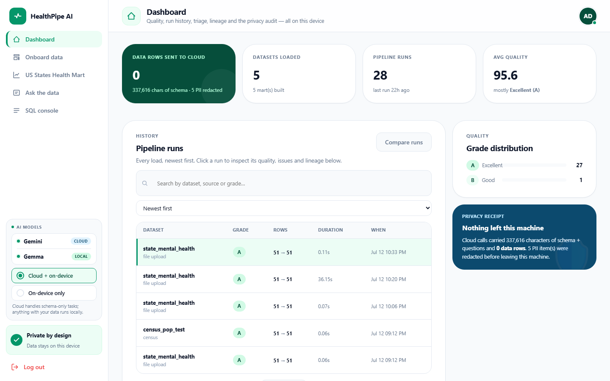
</p>

> An AI-powered local-first workbench for healthcare data — onboard any dataset, profile and govern it automatically, and let anyone query it in plain English, in minutes.

Runs on-device using **Gemma 3 4B** (open-weight local AI) with optional **Gemini Flash** for cloud-assisted queries — privacy-first by design, no data rows ever leave your machine.

Built for Deloitte's **Accelerate with AI** In-person Engineering Lab Session.


---

## The Problem

Healthcare datasets arrive raw and undocumented — a CSV from a lab vendor, a
database extract from an EHR system, a CMS file with 200 columns and no
codebook. Before a single analyst can touch it, a data engineer has to:

- **Profile it by hand** — null rates, outliers, type mismatches, duplicates;
  for a large file this alone takes half a day.
- **Write a data dictionary** — what each column means, valid ranges, known
  quirks. Without one, every downstream consumer guesses.
- **Eyeball data quality** — spot that `date_of_birth` has values in 2099, or
  that `patient_id` is 30 % null, or that `bmi` goes negative. No tooling, no
  AI, just grep and intuition.
- **Document lineage** — which source file, which transform script, which
  output table, which version. Almost never written down.
- **Gate access** — only after all of the above can the dataset be handed to
  analysts, who then queue SQL requests back to the same engineer.

That cycle takes **two to five days per dataset** in a typical health-data
team. And it repeats from scratch every time a new file arrives.

The root cause isn't laziness — it's that none of this work has been worth
automating with traditional tooling. Rule-based profilers catch obvious
problems but can't explain them. Static data dictionaries go stale the moment
the source changes. Lineage tracking is manual because every project has a
different shape.

**AI changes what's automatable.** A language model that runs locally can read
a raw schema and *explain* what each field likely represents. It can look at a
failed quality check and *describe* what's wrong in plain English, then
*propose a one-line fix* — in seconds, without a ticket. It can answer "which
counties have the highest uninsured rate?" in natural language, write and run
the SQL, and hand back a chart — without the analyst needing to know a single
join.

HealthPipe AI wires that capability into a governed, auditable workbench:
onboarding drops from days to **minutes**, the result is **self-service**, and
there is a clear record of exactly what (if anything) left the machine.

---

## Sign in

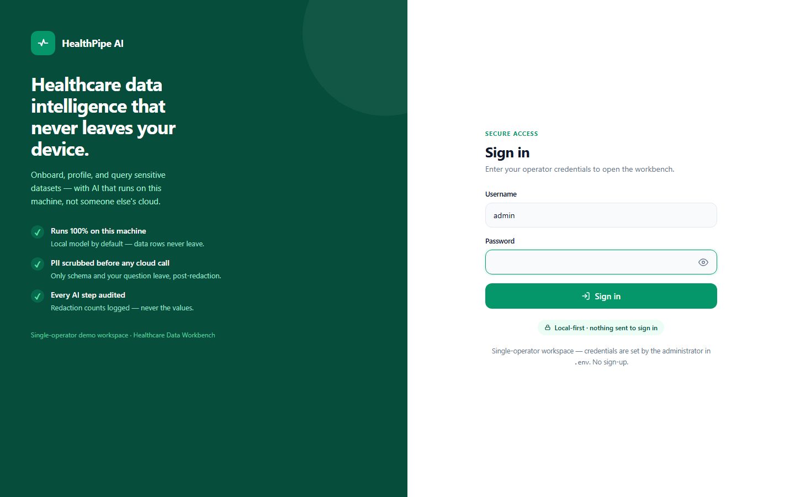

A single-operator login gate controlled by `MASTER_USERNAME` / `MASTER_PASSWORD`
in your `.env` file (git-ignored). Credentials are checked with constant-time
`hmac.compare_digest` — no database, no sessions, no token storage.

---

## Dashboard — command centre

Four headline metrics greet you after sign-in: **cloud data rows sent = 0**
(the privacy guarantee), datasets loaded, pipeline runs, and average quality
grade across all runs. The full run history lives below — click any row to
drill into its scorecard, schema, lineage, and AI briefing.

### Quality scorecard

Expanding any run reveals the complete **quality scorecard**: 15 automated
checks scored 0–100, graded A–F. Checks span completeness, null rates per
column, duplicate rate, type consistency, value ranges (negatives, ±4σ
outliers), and uniqueness — entirely in pandas, no AI involved.

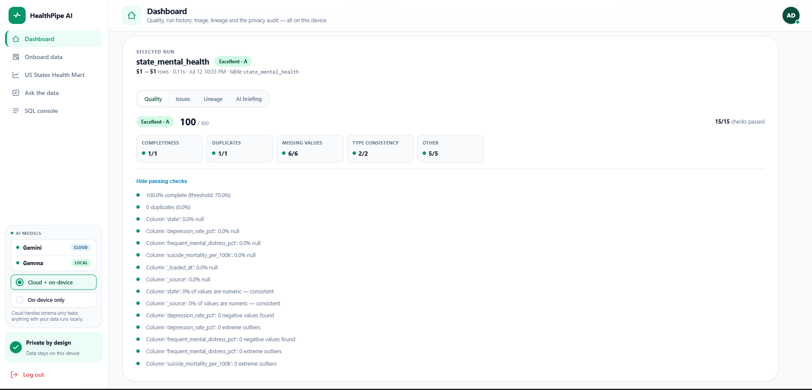

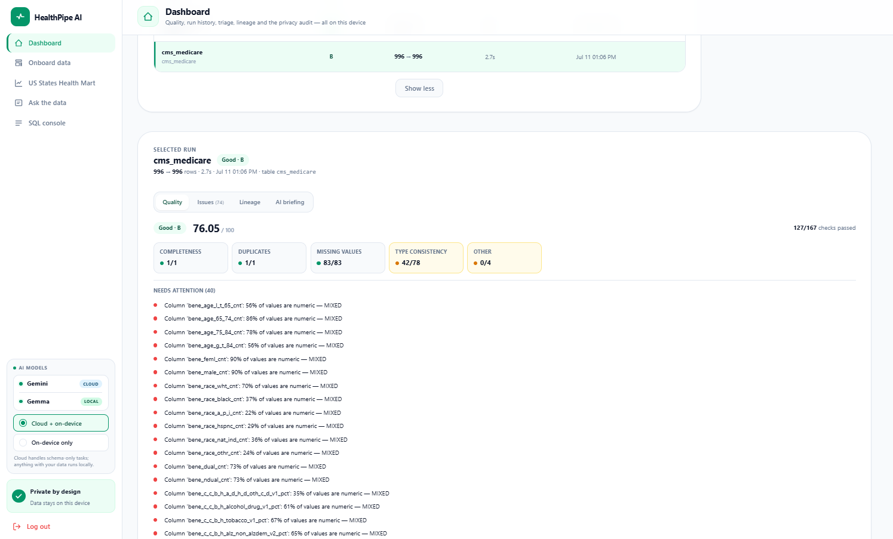

### Issue triage with AI

Every failed check becomes a **Critical / Warning / Info** card with the
affected column tagged. One click sends the check to on-device Gemma — it
explains the issue in plain English, all without any data leaving the machine.

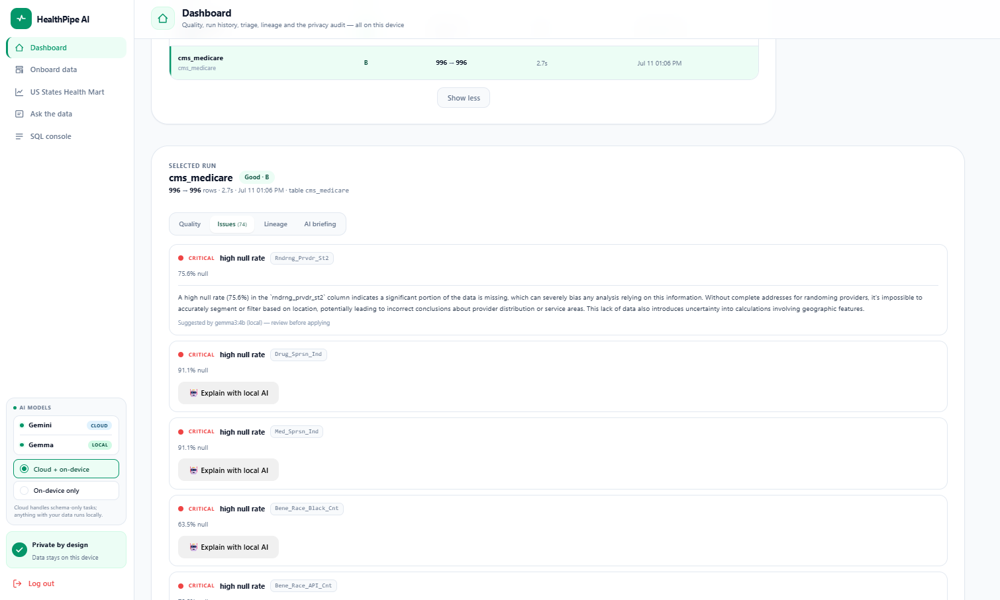

### Data lineage

A vertical timeline traces every dataset from **Source → Transform → Stored
table → Mart**. Each step shows the tool, action, and row count so you can
follow the data's exact path — nothing is a black box.

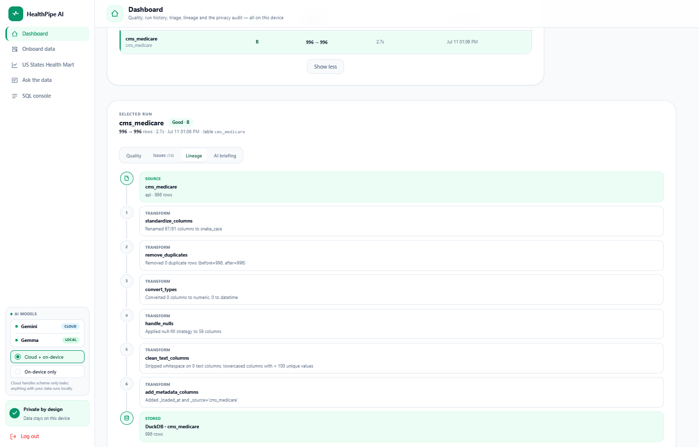

### AI briefing

After every onboard, the local Gemma 3 4B model writes a paragraph-length
dataset summary and a column-by-column data dictionary — entirely on-device.
No data value is sent anywhere.

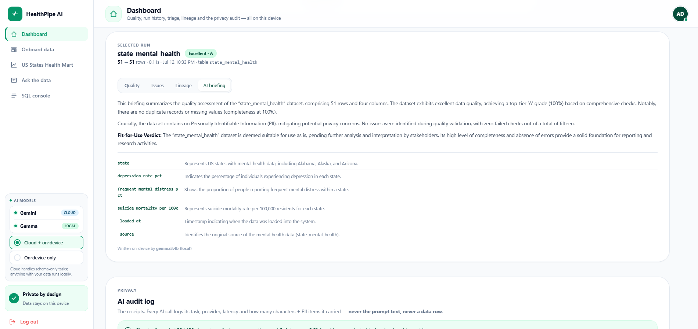

### Privacy audit log

Every AI call is logged: task type, model used, latency, characters of
schema/question sent, PII items redacted, and — always — **0 data rows
sent**. An immutable receipt stored locally in `outputs/ai_audit.jsonl`.

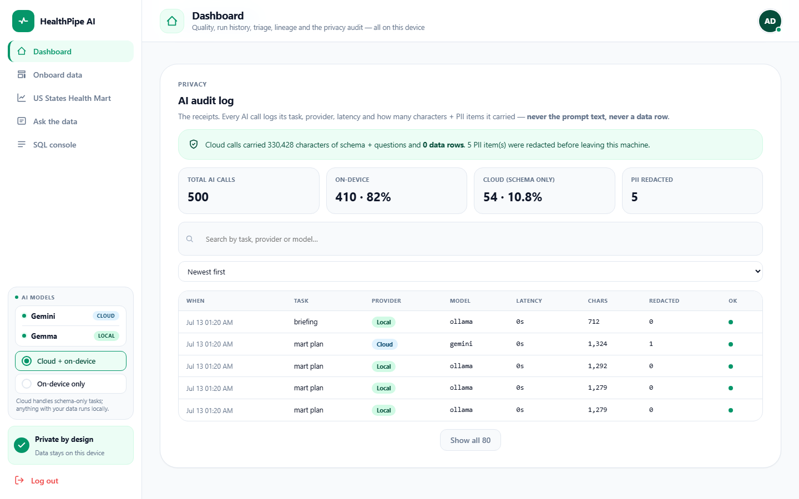

---

## Onboard Any Data Source

Import a local file, pull from a public health API, or connect directly to a
database. Four specialized agents run automatically in sequence.

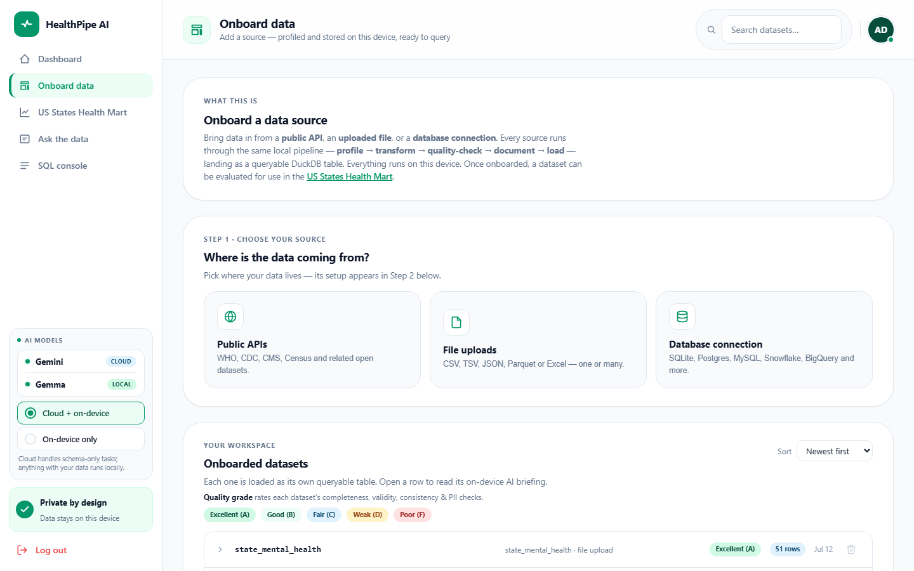

Three ingestion lanes: **Public API** (WHO, OpenFDA, CMS Medicare, CDC CDI,
CDC BRFSS, US Census), **file upload** (CSV, TSV, JSON, Parquet, XLSX), or
**database connection** (SQLite, PostgreSQL, MySQL, and 4 more). Heavy drivers
are lazy optionals — the core app never imports them. One-click install
handles the rest from inside the UI.

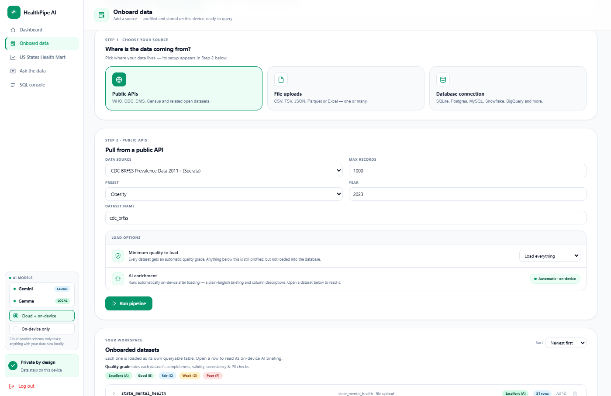

Configure source parameters, set your minimum quality grade threshold, and
run. The pipeline shows live progress as each agent stage completes.

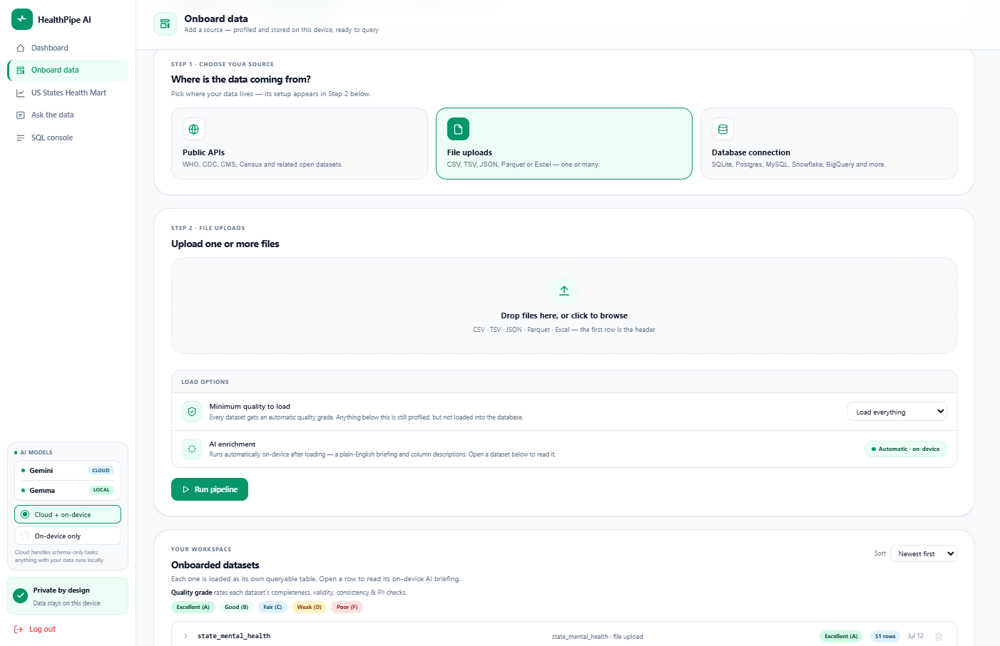

**Profile → Transform → Quality → Document** — all four agents run in under a
second for typical CSV files. The AI briefing and column descriptions generate
in the background once the pipeline finishes.

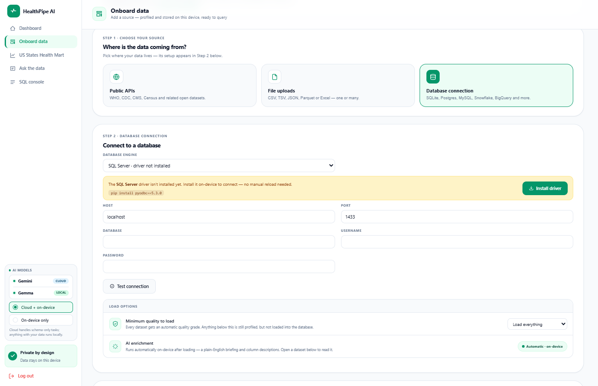

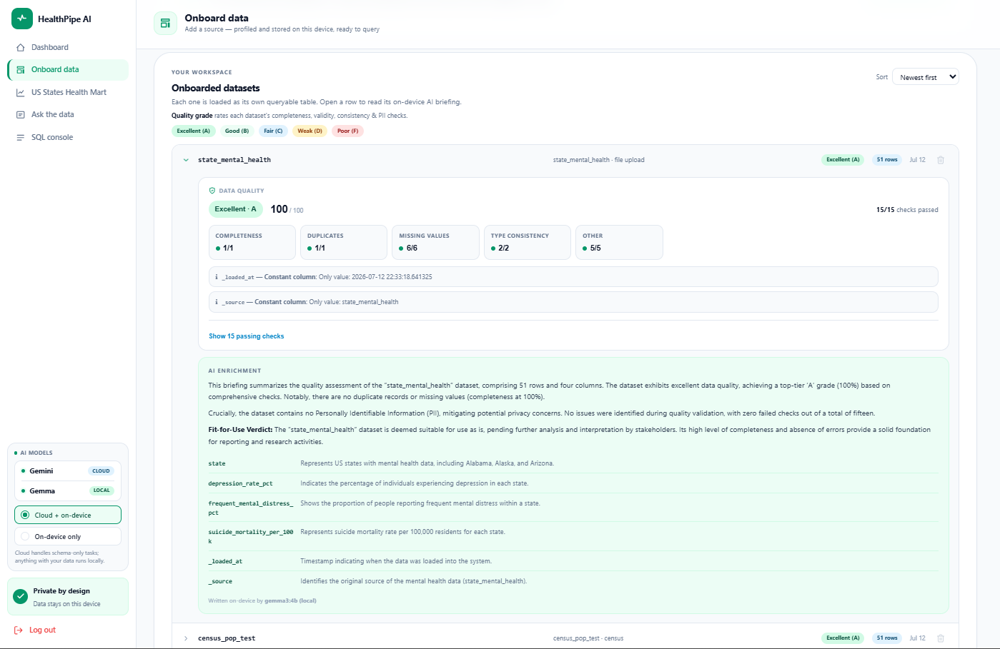

Every onboarded dataset is registered in your workspace: name, source type,
row count, quality grade, and timestamp. Expand any entry to open its full
scorecard, schema, lineage, and AI briefing on the Dashboard.

**The four agents in detail:**

1. **Profiler** — pure pandas/numpy analysis. Computes overview stats (row
   count, memory, completeness, duplicate count), per-column profiles (numeric
   min/max/mean/std, string patterns, datetime ranges), IQR-based outlier
   detection, strong correlations (>0.7), and flags PII-like columns — no AI
   involved.

2. **Transformer** — cleans in six deterministic steps: rename columns to
   `snake_case`, deduplicate rows, auto-detect and coerce types (numeric
   strings → float, ISO dates → datetime), fill nulls (median for numeric,
   `"Unknown"` for text), strip whitespace and normalize low-cardinality text,
   then stamp `_loaded_at` and `_source` metadata columns. Every step is
   written to an immutable transform log.

3. **Quality Checker** — runs 15 named checks across six categories: overall
   completeness, duplicate rate, per-column null rates, type consistency
   (mixed types in object columns), value ranges (unexpected negatives, extreme
   outliers at ±4σ), and uniqueness (ID-like columns verified as truly unique).
   Score = checks passed / total × 100. Grades: **A** ≥ 90, **B** ≥ 75,
   **C** ≥ 60, **F** < 60.

4. **Documenter** — writes a data dictionary (column name, inferred type,
   nullability, sample values, AI-generated description), a schema summary,
   a lineage entry (source → table, with the transform log attached), a
   quality summary, and usage notes — in both JSON and Markdown. Column
   descriptions come from the local Gemma model; no data value leaves the
   machine.

After the four agents finish, a background enrichment step fires: the local
Gemma model writes a professional **dataset briefing** (a paragraph-length
summary of the dataset — what it represents, its time coverage, key columns,
and notable quality flags). This appears under the run in the Dashboard as
the "AI briefing" tab.

---

## US States Health Mart

The United States is divided into 50 states plus Washington D.C. (the federal
capital), giving 51 geographic units that each publish their own public health
statistics. HealthPipe ships with a prebuilt analytical mart that joins three
US government open-data feeds at this state level — chronic disease rates from
the CDC (Centers for Disease Control and Prevention), healthcare spending from
CMS (Centers for Medicare & Medicaid Services, which runs the US federal health
insurance programme for people aged 65+), and population figures from the US
Census Bureau — into a single 51-row table ready for analysis.

Beyond that prebuilt mart, HealthPipe can plan and build a new mart from any
of your onboarded datasets using a single plain-English sentence.

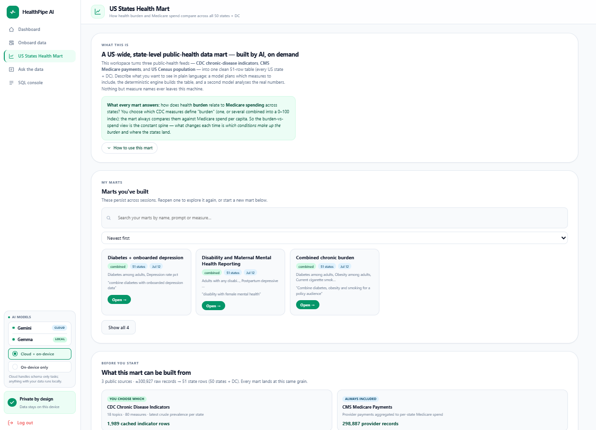

Describe what you want in one sentence. The workbench sends the **measure
catalog** (curated column definitions and their typical sources) to the AI,
which returns a mart plan: which sources to join, which measures to include,
at what grain. It then auto-suggests which onboarded datasets map to those
sources.

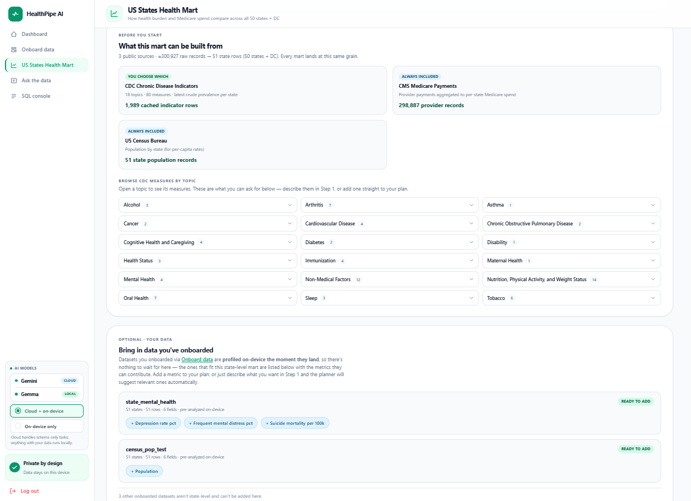

The AI plan arrives with source recommendations, measure definitions, and a
proposed join strategy — all reviewable before you run.

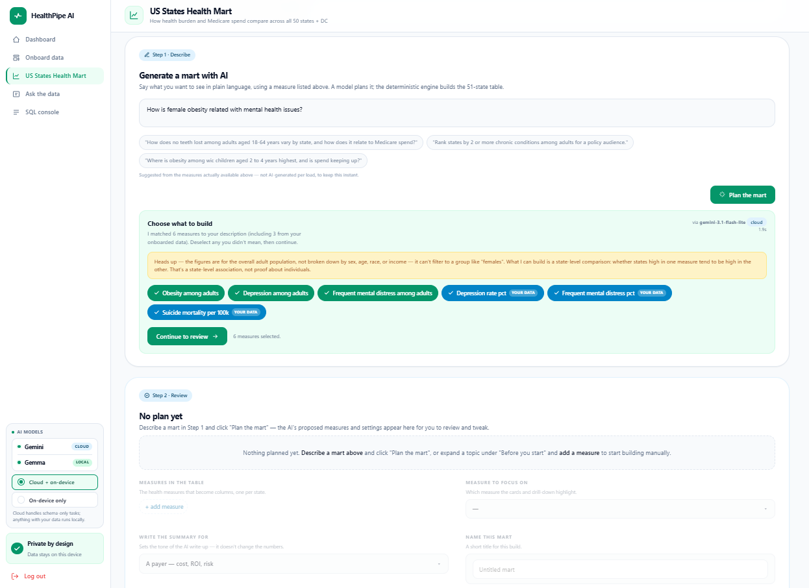

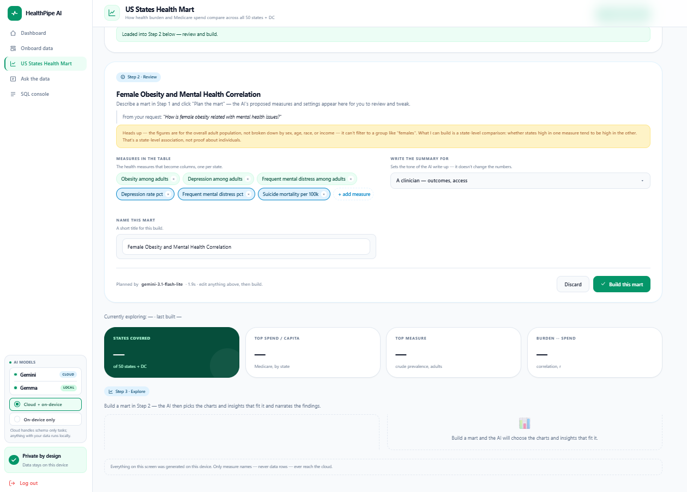

The join and aggregation run in DuckDB. The result is registered with its own
data dictionary and is immediately queryable in the chat interface.

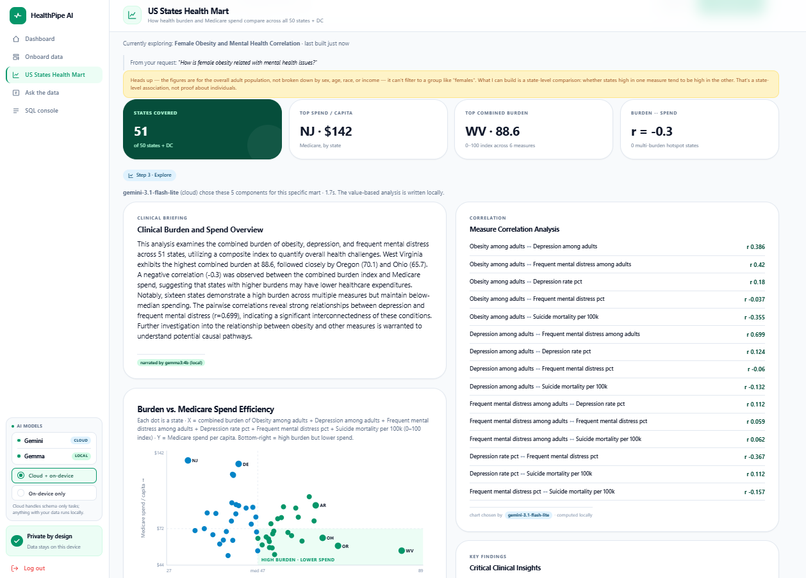

Open any built mart for a full analytics view: on-device clinical briefing,
scatter charts, per-measure correlation matrix, and burden index rankings —
all computed locally.

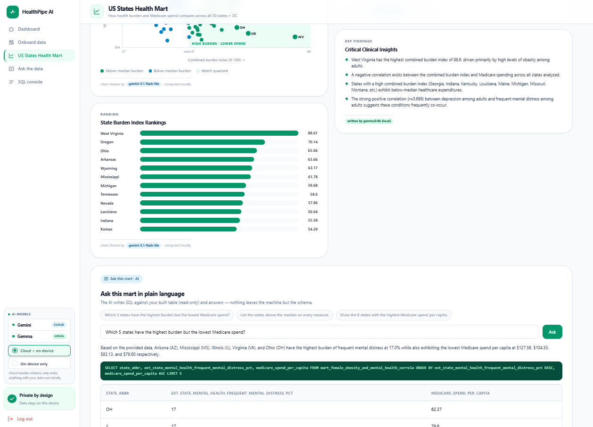

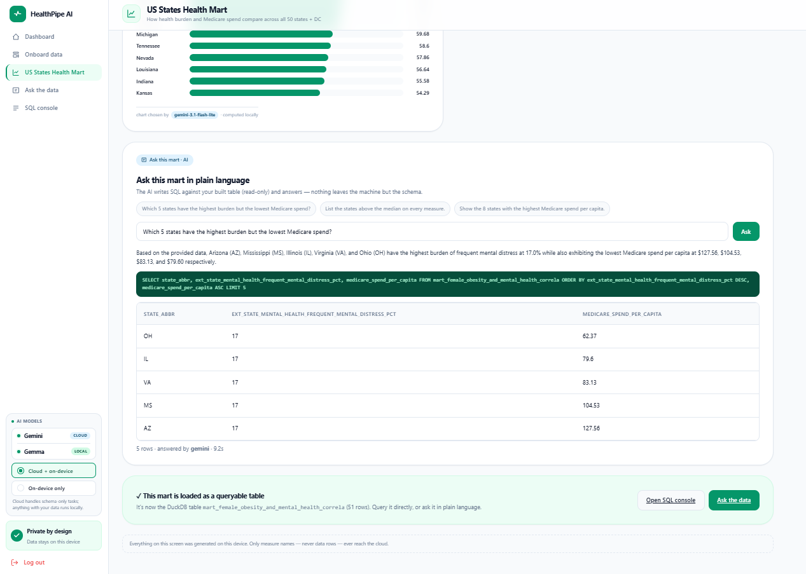

---

## Ask the Data

Non-technical users can query any onboarded table or mart in plain English.

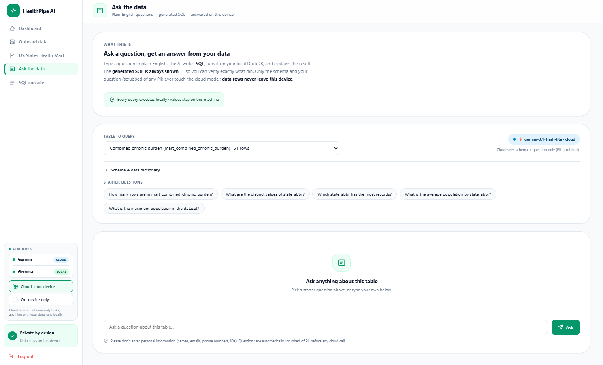

Select a table and type a question — or choose one of the schema-derived
**starter questions** (generated locally, zero AI cost). The workbench generates
safe, read-only SQL using Gemini (cloud, schema + question only) or Gemma
(local, always available as fallback), executes it against the local DuckDB,
and narrates the result.

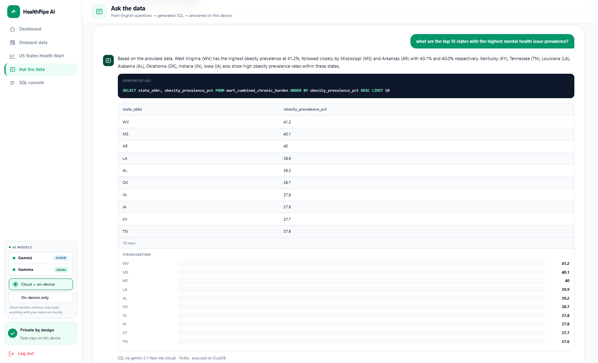

The generated SQL is always shown alongside the result table so analysts can
verify exactly what was run. On-device narration explains the answer in plain
English; PII is scrubbed before any cloud call is made.

---

## SQL Console

For direct queries without the AI layer, the SQL Console gives raw access to
the local DuckDB database.

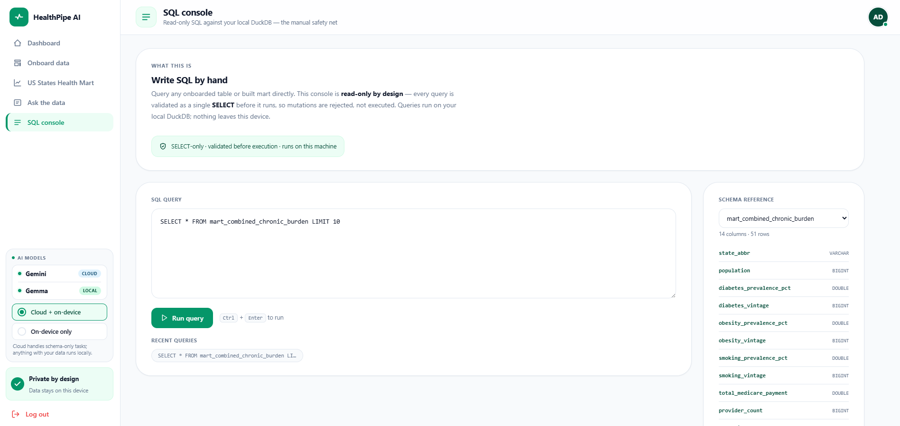

Write any read-only SELECT against any registered table or mart. The schema
reference panel lists all available tables and their columns — no need to
remember exact names.

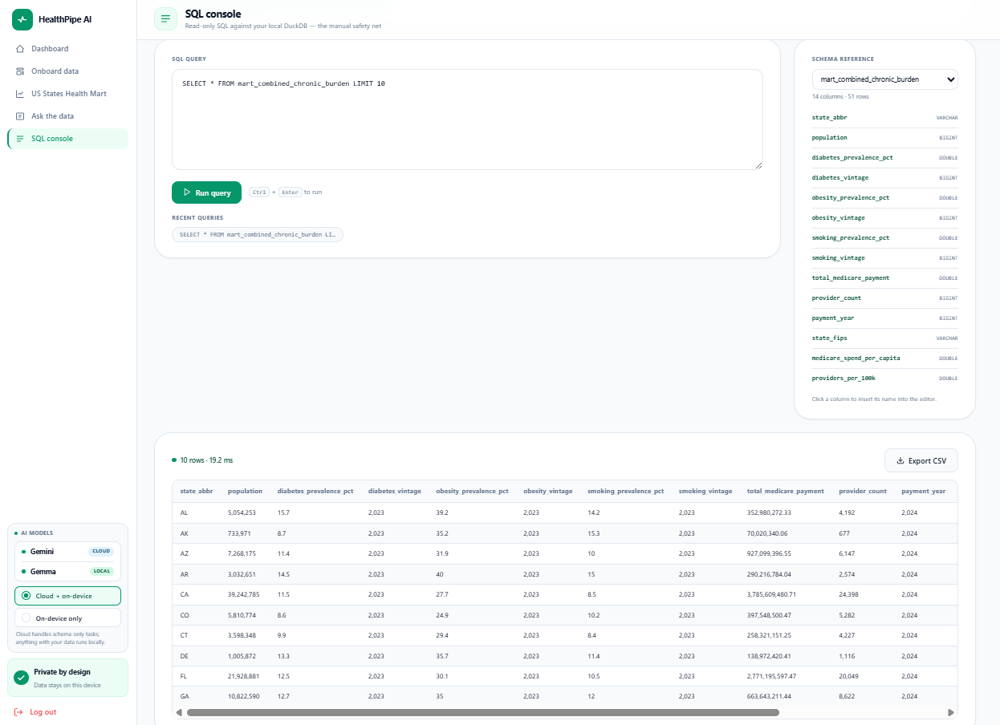

Results return in milliseconds — DuckDB runs entirely in-process. Every query
is limited to SELECT statements; mutations are rejected before execution.

---

## Runs Fully On Your Local Device

Every AI task *can* run entirely on-device — one sidebar toggle flips the
whole app to **On-device only** and nothing ever leaves the machine. The cloud
is strictly **optional**, used only for NL→SQL and mart planning, and even
then it only ever sees the schema/catalog and your question — never actual
data rows. No API key, or over the rate limit? Both features silently fall
back to the local model instead of failing.

## What It Demonstrates

This project showcases production-grade data engineering, governance, and
applied AI patterns:

- **Privacy-Preserving AI** — a strict local-vs-cloud boundary that ensures
  sensitive healthcare records never leave the local environment. The boundary
  is enforced in code (`core/router.py`), not just policy.
- **Idempotent Data Pipelines** — re-runnable, deterministic pipelines using
  pandas and DuckDB that yield identical results every time. Re-run the same
  source and you get the same cleaned table.
- **Abstract Registry Patterns** — all source connectors implement a common
  `BaseIngestionSource` ABC (`ingestion/`), so adding a new data source means
  writing one class, not modifying the pipeline.
- **Graceful Degradation** — the pipeline is fully functional with no AI
  models available. Every AI step has a rule-based fallback; the app never
  crashes because Ollama or a cloud key isn't present.
- **Lazy dependency loading** — heavy drivers (Snowflake, BigQuery, Oracle,
  etc.) are never imported at startup. They install on demand in one click
  from the Onboard screen (`core/driver_manager.py`).
- **Production-style test coverage** — 378 offline tests across 18 files, all
  external HTTP calls mocked with recorded fixtures. CI runs on both Python
  3.11 and 3.14.

## Architecture

```
SOURCES
  Public APIs (WHO, OpenFDA, CMS, CDC CDI, CDC BRFSS, US Census)
  Files (csv, tsv, json, parquet, xlsx)
  Databases (SQLite, PostgreSQL, MySQL, Snowflake, Redshift, Oracle, SQL Server)
  Cloud (S3, Azure Blob, Google Cloud Storage, Databricks, BigQuery)
    |
    v
AGENT PIPELINE (deterministic pandas + on-device AI enrichment)
  Profile -> Transform -> Quality -> Document
  + Briefing + Data Dictionary (gemma3:4b, local)
    |
    v
DATA LAYER (DuckDB + Reporting Marts)
  Cleaned source tables
  User-built marts + reporting_state_health (51 state grain)
    |
    v
FLASK WEB APP (Static HTML/CSS/JS)
  Dashboard (quality . run history . triage . lineage . privacy audit)
  Onboard (API / File / Database lanes)
  US States Health Mart (prebuilt + AI-generated)
  Ask the data (NL->SQL . DuckDB . auto-chart)
  SQL console (read-only SELECT . schema reference)
```

**AI Routing** (controlled from sidebar models panel):

- **Local** (`gemma3:4b` via Ollama) — profiling, briefings, descriptions,
  issue explanations, chat narration, starter questions, AND NL→SQL / mart
  planning whenever cloud is off, has no key, or is rate-limited. May see
  actual data values.
- **Cloud** (`gemini-3.1-flash-lite`) — NL→SQL + mart planning ONLY, and
  only when allowed. Prompt = schema/catalog + question (post-PII-redaction).
  Auto-falls back to local. Never sees data rows.
- **Privacy boundary** — data rows never cross from local to cloud.
- **On-device only** — one sidebar toggle routes everything to `gemma3:4b`.

**The UI** is a **Flask app serving static HTML/CSS/JS** (`run_server.py` →
`core/server.py` + `static/`) behind a login gate — no front-end framework,
no build step. All the data, pipeline, AI-routing and privacy logic lives in
`core/`, `agents/`, `analytics/` and `ingestion/`; the browser talks to it
over a small REST API (`/api/*`).

## The AI Design: Hybrid Routing & Open-Weight Models

HealthPipe is built around a **hybrid AI design**. A small, efficient
local model handles almost all tasks by default, while the cloud is used
narrowly, transparently, and only when you allow it.

### Open weight models & quantization — why local AI?

To maintain absolute data privacy — a non-negotiable requirement in
healthcare — HealthPipe relies heavily on a local, open-weight AI model
(Google's Gemma 3 4B, running via Ollama).

- **Open weights**: unlike proprietary cloud models (whose weights and
  data-handling policies are hidden behind commercial APIs), open-weight
  models let you download and run the actual model parameters locally. No
  data ever has to leave your device for the model to work.
- **Quantization**: large language models are normally too resource-heavy
  for consumer hardware. Through quantization (compressing the numerical
  precision of the model's weights — e.g. 16-bit floats down to 4-bit
  integers), `gemma3:4b`'s footprint shrinks to roughly **3 GB**. That's
  small enough to run entirely in local memory with fast CPU inference —
  advanced analytical capability with nothing sent anywhere.

### Hybrid routing breakdown

| Task | Model | Why |
|------|-------|-----|
| NL→SQL — "Ask the data" + mart chat | `gemini-3.1-flash-lite` (cloud) *preferred*, `gemma3:4b` (local) otherwise | The prompt is **schema + question only**, so it's safe to send, and cloud models are a bit stronger at SQL. Auto-falls back to local on rate-limit, missing key, or on-device-only mode — the feature never *depends* on the cloud. |
| Mart planning — NL prompt → mart spec | `gemini-3.1-flash-lite` (cloud) *preferred*, `gemma3:4b` (local) otherwise | The prompt is the **measure catalog + fixed schema names + your request** — no data rows — so it's cloud-safe by the same reasoning, with the same automatic local fallback. |
| Briefings, column descriptions, issue explanations, chat narration, starter questions | `gemma3:4b` (local, Ollama) **only** | These prompts contain **actual data values** to construct natural-language narratives, so they must never leave the machine — there is no cloud path for them, by design. |
| Profiling, transforms, quality checks, mart facts | none — pure pandas/numpy | Entirely deterministic. The AI only ever *describes* computed results; it never computes them. |

The sidebar **models panel** shows which models are available and lets you
flip the whole app between **Cloud + on-device** (default) and **On-device
only** (nothing leaves the machine, ever) in one click. A client-side rate
limiter (`core/rate_limit.py`) counts cloud calls per-minute and per-day and
switches to local *before* provoking a provider 429, so the app degrades
quietly instead of erroring.

### The privacy invariant (non-negotiable)

> The cloud only ever sees schema + question, post-redaction. It never sees
> actual data rows.

This is strictly enforced in `core/router.py` (only the two metadata-only
tasks — NL→SQL and mart planning — are cloud-eligible; every task that can
see data values routes local-only) and `core/analyst.py` (the cloud prompt
is built purely from column metadata after a rule-based PII scrubber in
`core/privacy.py` redacts sensitive terms). The Dashboard's **AI Audit**
section logs every one of these transactions to `outputs/ai_audit.jsonl` —
how many characters of schema+question each cloud call carried, that **0
data rows** left, and how many PII items were redacted first — so you can
verify exactly what was sent.

## Feature Matrix

| Category | Options | Demoed Live | Supported in Code |
|----------|---------|:-----------:|:------------------:|
| Public-data APIs | WHO, OpenFDA, CMS Medicare, CDC CDI, CDC BRFSS, US Census | CMS . CDC CDI . Census (the mart) | All 6 |
| File formats | CSV, TSV, JSON, Parquet, XLSX | CSV | All 5 |
| SQL engines | SQLite, SQL Server, PostgreSQL, Redshift, MySQL, Oracle, Snowflake | SQLite (demo clinic DB) | All 7 |
| Warehouses | Databricks, BigQuery | -- | Both |
| Cloud storage | Amazon S3, Azure Blob, Google Cloud Storage | -- | All 3 |

Heavy drivers are **lazy optionals** — the core app never imports them. The
Onboard screen installs the right pinned driver **on demand, one click**
(`core/driver_manager.py`).

## The Reporting Mart

`reporting_state_health` is a hand-built analytical mart — the kind a payer
analytics team maintains manually — joining three US government open-data
sources at **state grain** (one row per geographic unit: 50 US states +
Washington D.C. = 51 rows):

- **CDC** (Centers for Disease Control and Prevention) — chronic-disease
  prevalence rates for diabetes, obesity, and smoking, published annually
  at state level.
- **CMS** (Centers for Medicare & Medicaid Services) — Medicare spending
  data. Medicare is the US federal health insurance programme for people
  aged 65 and over; CMS publishes per-state payment totals and provider
  counts each year.
- **US Census Bureau ACS5** — population estimates from the American
  Community Survey 5-year rolling average, used to compute per-capita
  metrics.

**Vintage discipline:** healthcare datasets from different agencies are
rarely in sync — a state's 2023 CDC figure may exist while its 2023 CMS
figure has been suppressed. Each measure therefore carries its own vintage
year, chosen by a latest-non-null rule (e.g. if 2023 is suppressed, fall
back to 2022). The mart's footnote is assembled *from the data* so it can
never misstate the source years.

The join logic lives in `analytics/mart_builder.py`. It:

1. Pulls each source into DuckDB (from cache or live API).
2. Applies the measure catalog (`analytics/measure_catalog.py`) to select
   and rename columns to a stable schema regardless of which vintage year
   the source is from.
3. Joins at state grain on a canonical `state` key (FIPS-normalized — FIPS
   is the US federal standard for state identifiers).
4. Computes derived columns (Medicare spend per capita, obesity-diabetes
   correlation, etc.).
5. Registers the result as a DuckDB table and saves the mart spec + data
   dictionary to `outputs/`.

Beyond the built-in mart, the **US States Health Mart** screen can
**generate new marts with AI** from a plain-English prompt, auto-suggesting
relevant onboarded sources to fold in — every built mart is registered,
re-queryable, and enriched with its own data dictionary.

## Quick Start — Full Step-by-Step Installation Guide

### Prerequisites

1. **Python 3.11+** (tested up to 3.14.3 on Windows 11).
2. **Ollama** — download and install from ollama.com.

### 1. Set up local AI (one-time)

Launch Ollama and download the quantized Gemma 3 4B model:

```bash
ollama pull gemma3:4b
```

This is a ~3 GB download. Once done, Ollama serves the model as a local API
on `http://localhost:11434`. The Flask app detects it automatically.

### 2. Environment setup

Clone the repository and prepare your virtual environment
(Windows shown; use `source .venv/bin/activate` on macOS/Linux):

```bash
git clone <your-repo-url> healthpipe_ai
cd healthpipe_ai

python -m venv .venv
.venv\Scripts\activate
```

### 3. Install core dependencies

Heavy database/warehouse/cloud-storage drivers are omitted to keep the
footprint light — they install on demand later, from the Onboard screen.

```bash
pip install -r requirements-core.txt
```

**Optional connector tiers** (only when you need them):

```bash
pip install -r requirements-connectors.txt   # 7 SQL engines + Databricks + S3/Blob/GCS
pip install -r requirements-bigquery.txt      # BigQuery (pulls ~13 Google packages)
```

### 4. Configuration

Copy the sample environment file, then fill in `.env` (git-ignored — never
committed):

```bash
cp .env.example .env
```

| Key | Required? | Purpose |
|-----|-----------|---------|
| `MASTER_USERNAME` / `MASTER_PASSWORD` | Yes | Pick any username and password — these are just the login credentials for the app's own gate. No account or registration needed. |
| `GEMINI_API_KEY` | Optional | Powers cloud-assisted NL→SQL and mart planning. If empty, both features run on-device automatically. |
| `GEMINI_MODEL` | Optional | Override the default `gemini-3.1-flash-lite`. |
| `GEMINI_RPM_LIMIT` / `GEMINI_DAILY_LIMIT` | Optional | Client-side cloud rate limits (defaults: 5/minute, 200/day) — auto-falls back to local `gemma3:4b` when exceeded. |
| `CENSUS_API_KEY` | Optional | Live Census/mart pulls (a cached mart still works without it). |

**Getting optional API keys:**

- **`GEMINI_API_KEY`** — Go to [Google AI Studio](https://aistudio.google.com), sign in with any Google account, and click **Get API key**. Create a key in any project. The free tier (Gemini Flash) gives 15 requests/minute and 1,500/day — more than enough for demo use. No billing setup required for the free tier.

- **`CENSUS_API_KEY`** — Request a free key at [api.census.gov/data/key_signup.html](https://api.census.gov/data/key_signup.html). Fill in your email and organisation name; an activation link arrives within a few minutes. This key is used only for live Census data pulls — the prebuilt `reporting_state_health` mart loads from a cached copy and works without it.

### 5. Preflight & run

```bash
# Verify environment health — prints a checklist table
python scripts/preflight.py

# Start the Flask web application
python run_server.py
```

Open **http://localhost:8501** and sign in with your `MASTER_USERNAME` /
`MASTER_PASSWORD` to land on the Dashboard.

### What to expect on first run

- **No Ollama**: the app starts fine. Profiling and pipeline still run
  (they're pure pandas). AI briefings and descriptions will be blank until
  Ollama is available. NL→SQL falls back to the cloud if a Gemini key is set,
  or shows an "AI unavailable" message if not.
- **No Gemini key**: NL→SQL and mart planning run on the local Gemma model
  instead. This works well for most queries; complex multi-table joins may
  be less reliable.
- **First onboard is slower**: Ollama loads the model into memory on its
  first inference (30–60s on CPU). Subsequent calls are much faster.

## Project Layout

```
core/         Flask server + engine
  server.py         REST API + static file serving (the single entry-point)
  router.py         AI task router — cloud vs. local eligibility, fallback logic
  analyst.py        NL->SQL: build cloud-safe prompt, execute, narrate result
  pipeline.py       Orchestrates the 4-agent run: profile->transform->quality->doc
  enrich.py         Background AI enrichment (briefing, column descriptions)
  privacy.py        Rule-based PII scrubber (redacts before any cloud call)
  audit.py          Immutable AI audit log (outputs/ai_audit.jsonl)
  rate_limit.py     Client-side cloud rate limiter (RPM + daily cap)
  database.py       DuckDB connection pool + schema utilities
  driver_manager.py On-demand DB driver registry and pip installer
  history.py        Pipeline run history (outputs/run_history.jsonl)
  providers.py      Model availability checks (Ollama / Gemini)
  auth.py           Login gate (hmac.compare_digest credential check)
  config.py         All env vars, thresholds and path constants

agents/       Deterministic pandas agents — no AI in the pipeline itself
  profiler.py       Statistical profiling (IQR outliers, PII flags, correlations)
  transformer.py    6-step cleaning pipeline (snake_case, types, nulls, metadata)
  quality_checker.py  15-check quality scorecard (grades A–F)
  documenter.py     Data dictionary + lineage + usage notes (JSON + Markdown)

analytics/    Mart and reporting layer
  mart_builder.py   Executes the mart join + aggregation in DuckDB
  mart_planner.py   NL prompt -> mart plan (source selection, measure mapping)
  measure_catalog.py  Curated list of CDC/CMS/Census measure definitions
  drift.py          Schema-drift comparison between two pipeline runs
  lineage.py        Lineage graph builder (source -> table -> mart)

ingestion/    Source connectors (all implement BaseIngestionSource ABC)
  api/              WHO, OpenFDA, CMS, CDC CDI, CDC BRFSS, Census ACS5
  file/             CSV, TSV, JSON, Parquet, XLSX
  database/         SQLite, PostgreSQL, MySQL, Redshift, Oracle, SQL Server, Snowflake
  warehouse/        Databricks, BigQuery
  storage/          S3, Azure Blob, Google Cloud Storage
  registry.py       Source registry — maps source names to connector classes

static/       The web app — served directly by Flask, no build step
  login.html        Sign-in page
  pages/            dashboard.html, onboard.html, mart.html, chat.html, sql.html
  css/              Design system (hp-* tokens, cards, badges, sidebar, responsive)
  js/               Shared utilities (charts, table renderer, provider badge)
  healthpipe_logo.svg

scripts/      Operational utilities
  preflight.py      Environment health check (Ollama, Gemini, DuckDB, Python version)
  smoke_analyst.py  Local AI SQL accuracy test (no network needed)
  smoke_ai.py       Full AI smoke test (Ollama + optional cloud)
  capture_screenshots.py  Playwright-based README screenshot capture

tests/        378 tests across 18 files
  test_pipeline.py  End-to-end pipeline (profiler, transformer, quality, documenter)
  test_analyst.py   NL->SQL prompt construction and response parsing
  test_privacy.py   PII scrubber (redaction, schema-only prompt, audit log)
  test_router.py    Cloud vs. local routing decisions, fallback logic
  test_ingestion.py API, file, database and warehouse connectors
  test_mart*.py     Mart builder, planner, measure catalog, drift
  test_hardening.py README and codebase invariant checks
  (+ 10 more files)  Auth, audit, config, history, server API, driver manager

outputs/      Generated at runtime — git-ignored
  healthpipe.duckdb       The live database (source tables + marts)
  run_history.jsonl       Immutable pipeline run log
  ai_audit.jsonl          Immutable AI call audit log
  enrichment/             Per-table AI briefings + column descriptions (JSON)
  quality/                Per-run quality scorecards (JSON)
  registry/               Registered mart specs (JSON)
  docs/                   Auto-generated data dictionaries (Markdown)

data/sample/  Sample datasets, test fixtures, demo SQLite DB + fixture generators
data/cache/   Cached source pulls + uploads — git-ignored
docs/screenshots/  README demo images (generated by scripts/capture_screenshots.py)
```

## Testing & Verification

The workbench features an extensive offline test suite. All external HTTP
requests are mocked with recorded fixtures, so the whole suite runs with no
network:

```bash
# Run the offline suite (378 tests across 18 files)
pytest -q -m "not network"

# Verify the local AI analyst's SQL generation accuracy
python scripts/smoke_analyst.py
```

**Continuous Integration (CI):** GitHub Actions runs the offline suite on
both **Python 3.11** and **3.14** on every push/PR to `main`
(`.github/workflows/ci.yml`). Live-API tests are marked
`@pytest.mark.network` and excluded from CI.

## Roadmap

Deferred, honestly flagged rather than half-built:

- **Live warehouse demos** (Snowflake / BigQuery / Databricks) with trial
  accounts — supported in code today, not yet demoed with live credentials.
- **County-level drill-down** in the mart (currently state grain).
- **Scheduled / incremental runs** (currently on-demand onboarding).
- **Multi-table joins in chat** (chat is single-table by design; joins
  happen upstream in marts).
- **Real server-side sessions** (the demo login is a client-side gate
  today).

## Development Process

This project was designed, architected, and verified by Kaustav
Purkayastha as a portfolio piece for Deloitte's consulting services AI &
Data group.

- **System design & direction** — the original product concept, the
  multi-agent pipeline flow, the local-vs-cloud security boundary, the
  data-quality scoring metrics, and the custom task-based router were
  directed by Kaustav.
- **AI assistance** — Claude Code and GitHub Copilot were used to
  accelerate development on repetitive components (mock data fixtures,
  HTML/CSS dashboard templates, boilerplate), leaving focus on the core
  data engineering patterns and system testing.

## Built With

| Layer | Technology |
|-------|-----------|
| Language | Python 3.14.3 (also tested on 3.11) |
| Web server | Flask — serves both the REST API and static files |
| Frontend | Vanilla HTML / CSS / JavaScript — no framework, no build step |
| Data warehouse | DuckDB — in-process SQL engine for all pipeline output and mart queries |
| Data processing | pandas + NumPy — all profiling, transforms, and quality checks |
| Local AI | Gemma 3 4B via Ollama — on-device LLM for briefings, issue explanations, NL→SQL fallback |
| Cloud AI | Google Gemini Flash Lite — NL→SQL and mart planning (schema + question only, never data rows) |
| Public data | WHO, OpenFDA, CMS Medicare, CDC CDI, CDC BRFSS, US Census ACS5 |
| Testing | pytest — 378 offline tests across 18 files |
| CI | GitHub Actions — runs the offline suite on Python 3.11 and 3.14 on every push |
| AI-assisted development | Claude Code, GitHub Copilot |

## License

[Apache 2.0](LICENSE) © 2026 Kaustav Purkayastha.
